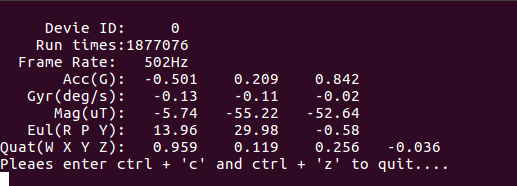

# ROS例程

​	本文档介绍了如何在Ubuntu平台上，用ROS来读取HI226/HI229的数据，本路径提供了c++语言例程代码，通过执行ROS命令，运行相应的节点，就可以看到打印到终端上的信息。

​	测试环境：Ubuntu16.04   

​	ROS版本：ROS Kinetic Kame

​	测试设备：HI226 HI229

## 查找USB-UART设备

​	因为Ubuntu 系统自带CP210x的驱动，所以不用专门去安装相应串口驱动。将调试版连接到电脑上时，会自动识别设备。识别成功后，会在dev目录下出现一个对应的设备文件。

​	检查系统是否识别到USB-UART设备：

​	1、打开Ubuntu系统，按下 __ctrl + alt + t__ 打开命令行窗口

​	2、在窗口上输入 `cd /dev`  切换到dev目录下，这个目录下，是一些设备文件。

​	3、然后在dev目录下执行`ls` 这个命令是查看当前目录下都有哪些文件，然后按下 Enter 键，就会出现设备文件名称，在这些文件名称中，主要关心 **ttyUSB** 这个设备文件。后面数字代表USB设备号，由于Ubuntu USB设备号为从零开始依次累加，所以多个设备每次开机后设备号是不固定的，需要确定设备的设备号。下面用两张图片来描述:


​	上图为没有插入USB设备的情况，这个时候，dev目录下并没有名为 __ttyUSB__ 文件，插入USB线，连接调试板，然后再次执行`ls`：

dev目录下多了几个文件名称, 如图：


​	**ttyUSB0** 文件就是调试版在ubuntu系统中生成的设备文件，对它进行读写，就可以完成串口通信。这个文件名称我们把它记下来。后面的数字是不固定的，有可能为 **ttyUSB1**  或 **ttyUSB2** 等。

## 安装serial软件包

​	本例程使用ROS提供的serial包实现串口通信.

​	首先执行如下命令，下载安装serial软件包：

```c
sudo apt-get install ros-kinetic-serial
```

然后输入`roscd serial`命令，进入serial下载位置，如果安装成功，就会出现如下信息：

```shell
$:/opt/ros/kinetic/share/serial
```

## 创建工作空间

先输入命令`export | grep ROS`确定环境变量是否设置正确。

若出现如下信息，说明是正确的：

```shell
declare -x ROSLISP_PACKAGE_DIRECTORIES=""
declare -x ROS_DISTRO="indigo"
declare -x ROS_ETC_DIR="/opt/ros/indigo/etc/ros"
declare -x ROS_MASTER_URI="http://localhost:11311"
declare -x ROS_PACKAGE_PATH="/opt/ros/indigo/share:/opt/ros/indigo/stacks"
declare -x ROS_ROOT="/opt/ros/indigo/share/ros"
```

如果已经有创建好的工作空间，在__ROSLISP_PACKAGE_DIRECTORIES__后边会跟着工作空间的路径。

如果不正确，请先设置环境变量。

接下来，就是创建一个工作空间，名为__catkin_ws__：

```shell
$ mkdir -p ~/catkin_ws/src
$ cd ~/catkin_ws/src
$ catkin_init_workspace
```

进入工作空间，编译这个工作空间。

```shell
$ cd ~/catkin_ws
$ catkin_make
```

这时候，可以看到build和devel两个文件夹，和src并列。

在devel文件夹中，有几个setup.*sh文件，通过source命令激活这些文件中任何一个文件都会将这个工作空间覆盖到环境中：

```shell
$ source devel/setup.bash
```

然后输入`echo $ROS_PACKAGE_PATH`命令，确认工作空间的路径是否设置正确。

如果出现  __/opt/ros/kinetic/share__  ，说明设置正确。

## 编译serial_imu节点

​	接下来，执行`cd ~/catkin_ws/src`命令，进入src目录，将本文档所在的目录下的serial_imu文件夹复制到src目录下，包括serial_imu文件夹下的文件。

​	然后回到catkin_ws目录下，执行`catkin_make`命令，编译成功后出现完成度100%的信息。

## 查看数据

​	查看数据，就要运行相应的节点。

​	在Ubuntu环境中，波特率支持到115200,460800,921600，本例程使用的是115200。

​	本例程使用的波特率是115200，打开的串口名称是/dev/ttyUSB0，默认的输出频率为100Hz。如果您需要更高的输出频率，请执行`cd ~/catkin_ws/src/serial_imu/src`命令，进入src目录，打开serial_imu.cpp文件，修改serial_imu.cpp文件中的sp.setBaudrate()函数的参数，改为更高的波特率。	


​	如图所示：修改到合适的波特率和对应的串口名称。

​	修改完成后，在回到catkin_wa目录下，重新执行`catkin_make`命令，重新生成。

​	生成成功后，执行`roscore`命令。

​	然后重新打开一个终端，执行`rosrun serial_imu serial_imu`命令。

​	执行成功后，就可以看到如下界面：



## 执行的过程中，可能会出现的问题

​	如果在执行`rosrun serial_imu serial_imu`时候，出现如下错误：


​	这是由于没有配置环境的原因导致的，解决办法就是在当前终端执行`source ~/catkin_ws/devel/setup.bash`命令。

​	但是这个办法并不能一次性解决，每次开启一个终端，运行新节点都需要为该终端设置环境变量。所以按照如下方式，可以不用这么麻烦：

​	执行`gedit ~/.bashrc`命令，打开一个文件，然后在这个文件的末尾加入ROS程序注册命令。

```shell
source /home/linux/catkin_ws/devel/setup.bash
```

​	保存并退出。

​	还有就是可能会遇到串口打开失败，权限不够。执行如下命令，申请权限。

```shell
sudo chmod 777 /dev/ttyUSB0
```

​	然后开启一个终端，执行`rosrun serial_imu serial_imu`命令，执行成功。